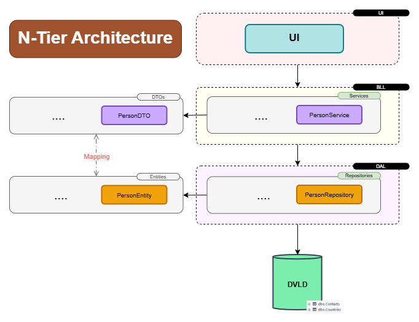
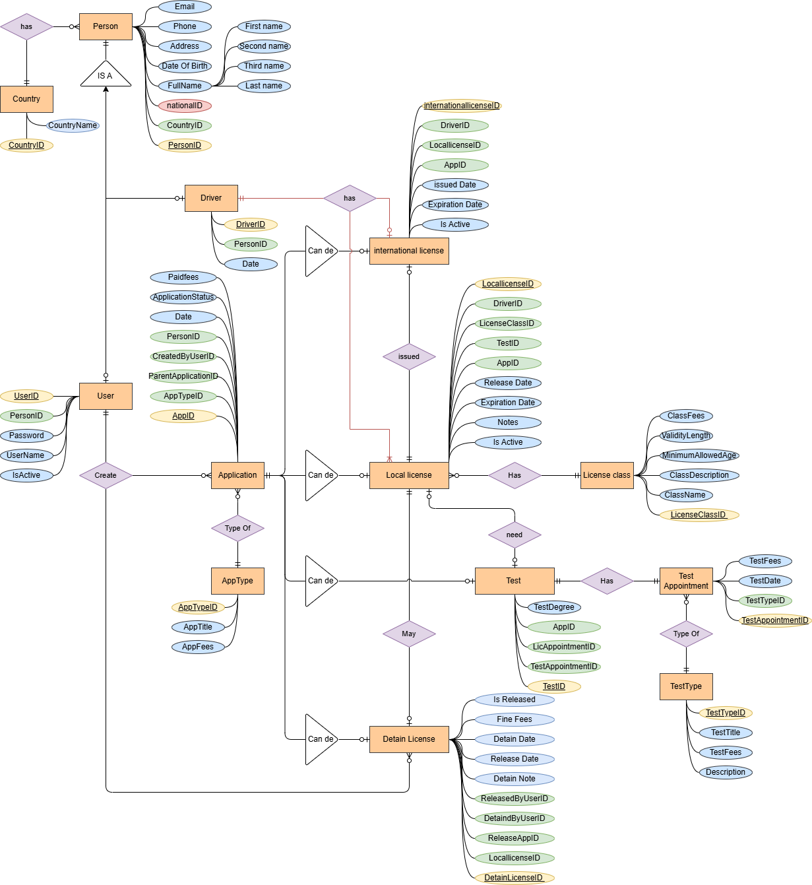
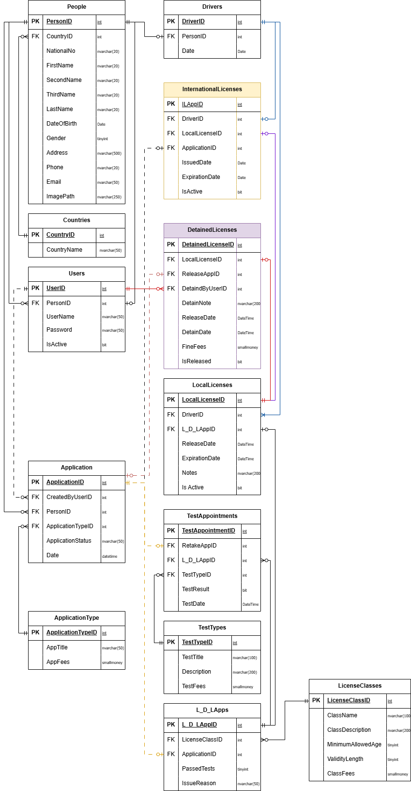

# DVLD - Driver & Vehicle License Department

## 🎥 Project Demo


https://github.com/user-attachments/assets/25dbf2af-84c9-49ce-8334-a2612568b66c


---

## 🏗️ Architecture

The project is built using a **3-Tier / N-Tier Architecture** to separate the presentation, business logic, and data access responsibilities.



### Architecture Layers

- **UI (Presentation Layer)** — Handles the user interface and user interactions.
- **BLL (Business Logic Layer)** — Contains business rules, services, and application logic.
- **DAL (Data Access Layer)** — Handles communication with the SQL Server database.
- **DTOs** — Used to transfer data between application layers.
- **Entities** — Represent the main domain and database entities.

The project also uses patterns and practices such as **Repository Pattern, Dependency Injection, DTOs, and Separation of Concerns**.

---

## 🗄️ Database Design

### ERD (Entity Relationship Diagram)

The database was designed around the application's business workflows and relationships between people, users, drivers, applications, licenses, exams, and other related entities.



### Relational Schema



---

## ✨ Features

The system provides functionality for managing:

- People
- Users
- Drivers
- Applications
- Local Driving Licenses
- International Driving Licenses
- License Classes
- License Detention & Release
- Exams & Test Appointments
- Test Types
- Countries
- License Replacements
- License Renewal
- Other driver and license-related operations

---

## 🛠️ Technologies

- **C#**
- **.NET**
- **Windows Forms**
- **SQL Server**
- **ADO.NET**
- **3-Tier / N-Tier Architecture**
- **Repository Pattern**
- **Unit of Work**
- **Dependency Injection**
- **DTOs**

---

## 🗃️ Database Backup

A SQL Server database backup is included in the repository:

```text
Database/DVLD.bak
